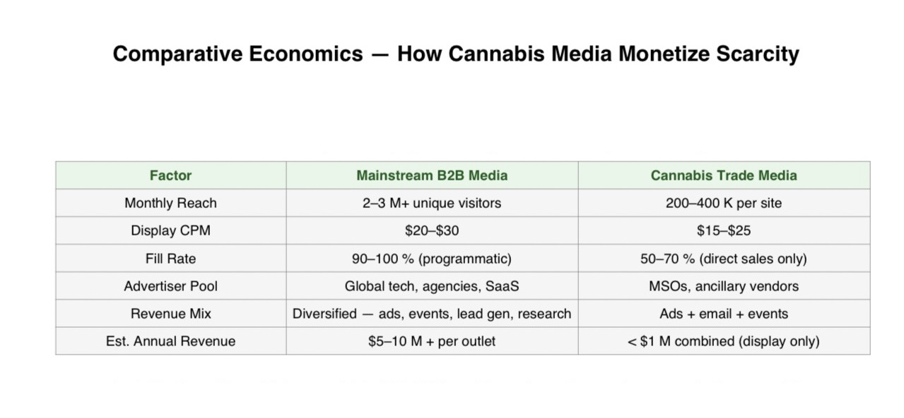
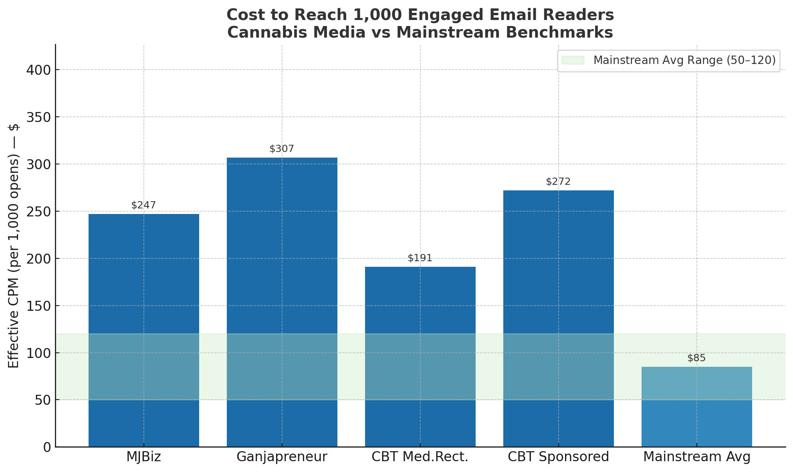
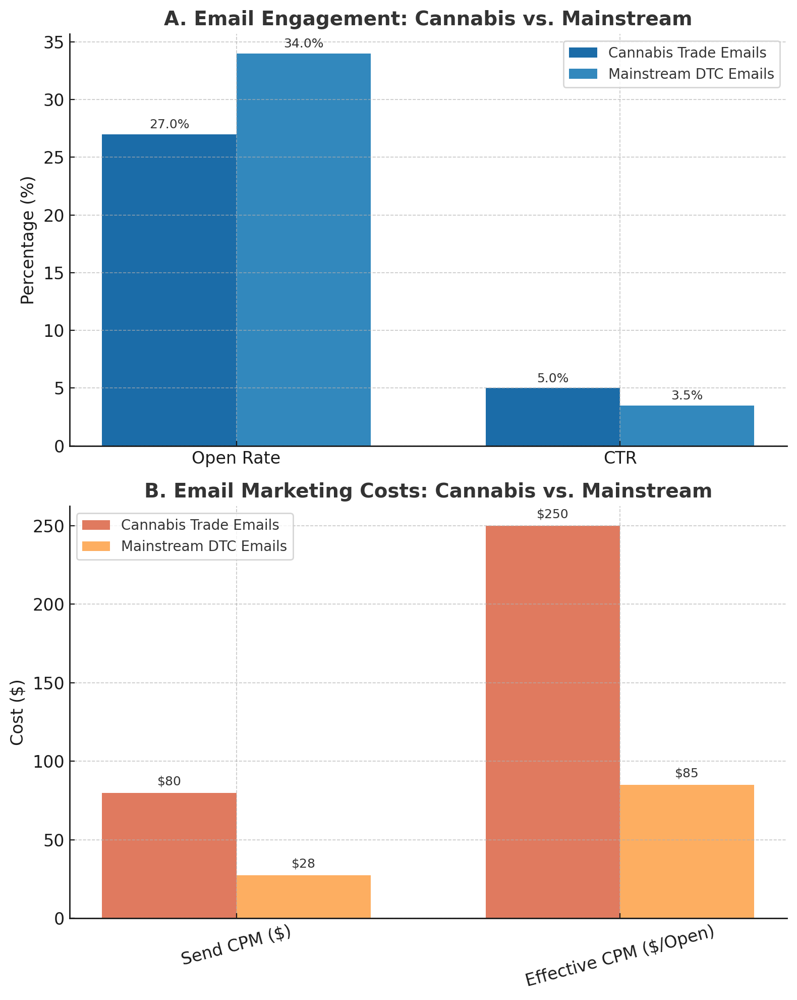
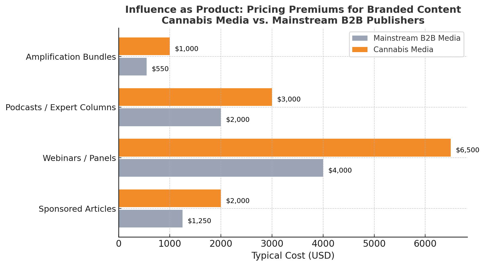
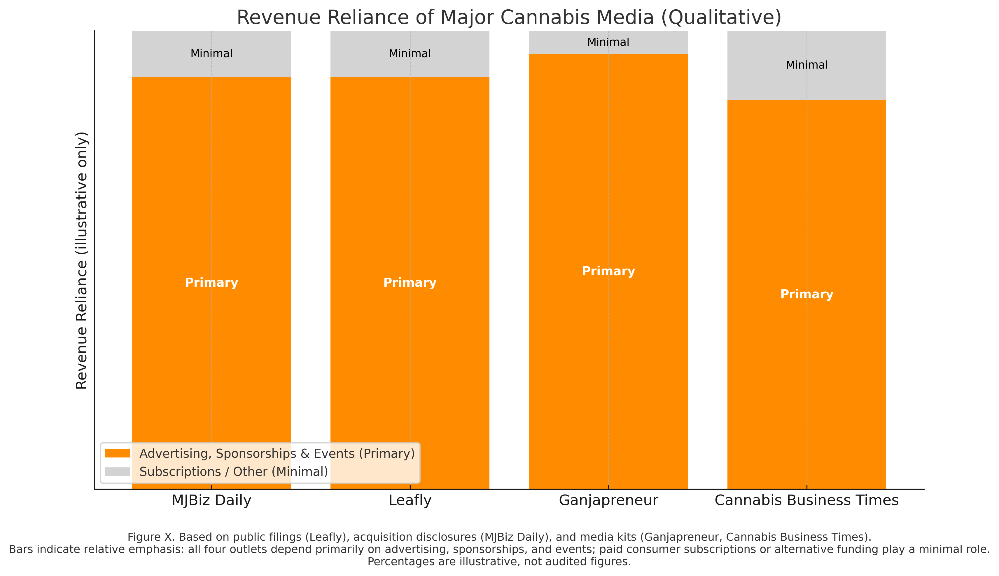
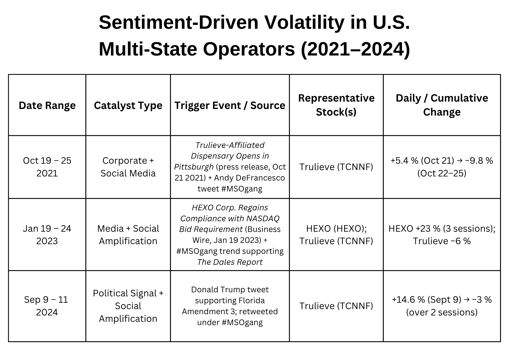

# Systemic Disinformation: Cannabis and the Inherited Logic of Datafied Prohibition

**Author:** Madicyn Marinaro  
**Role:** Cannabis Media Researcher  
**Entity:** Cannabis Council for Advertising Transparency (CCAT)  
**Document Type:** Cambridge Disinformation Summit Working Paper  

---

## Abstract

This paper argues that the legal cannabis sector provides one of the clearest demonstrations that disinformation can evolve into systemic risk. The twentieth-century propaganda that framed cannabis as dangerous did not disappear with legalization—it was absorbed into the infrastructures that now govern visibility, legitimacy, and value. Through platform moderation, brand-safety classifiers, compliance software, laboratory standards, and financial risk models, inherited bias circulates as code. The result is **Datafied Prohibition**: the migration of stigma into technology, where fear is automated and profitably sustained.

Drawing on the theories of Zuboff, Pasquale, Srnicek, and Harvey—alongside data from the *2025 Cannabis Media Transparency & Advertising Report* and market analysis—the paper demonstrates how disinformation embedded in digital and regulatory systems becomes self-reinforcing. Advertising restrictions manufacture scarcity; compliance platforms monetize access; and volatility becomes a tradable asset. These mechanisms do not distort a stable system—they are the system.

Cannabis exposes disinformation not as a relic of the past but as a living architecture of control. It reveals how inherited falsehoods can destabilize entire domains of governance, economy, and knowledge—proving that when propaganda becomes infrastructure, it produces risk that no institution can diversify away.

---

## Introduction

For nearly a century, cannabis has served as a laboratory for narrative control and the production of disinformation at scale. Tracing this history allows us to see how past propaganda becomes embedded in modern technological infrastructures. Cannabis thus provides a cautionary case of how disinformation adapts, mutates, and ultimately becomes a form of systemic risk. 

In the 1930s, the campaign against cannabis culminated in what is now referred to as “Reefer Madness,” one of the most notorious and effective disinformation efforts in U.S. history. Soon after the establishment of the Federal Bureau of Narcotics, its commissioner Harry Anslinger led a coordinated propaganda campaign in collaboration with Hearst-owned newspapers. This effort strategically fused racism, moral panic, and commercial interest. The message was chillingly effective: cannabis users were portrayed as prone to insanity, violence, and moral and sexual deviance. Cannabis posed a threat to white womanhood and the nation’s youth (Bonnie & Whitebread 1974, 100-109).

Through the alignment of political and commercial interests (rather than scientific consensus), the Marijuana Tax Act of 1937 cemented propaganda into federal law. The consequences were systemic. The Marijuana Tax Act did not simply criminalize a plant; it effectively criminalized entire communities. Cannabis prohibition disproportionately targeted Black and Mexican Americans, expanded law enforcement budgets, and significantly contributed to the development of the prison industrial complex (Bonnie & Whitebread 1974; King & Mauer 2006; Gundai et al. 2022). 

The effectiveness of the Reefer Madness propaganda campaign rested not only on deception, but on design. Its sensationalism established an emotional and cultural architecture that continues to structure virality today: vivid imagery, moral outrage, and repetition. Scholars of information disorder have demonstrated that emotionally charged, visually striking, and frequently repeated messages circulate independent of accuracy. Repetition produces cognitive ease, and familiarity then supersedes truth (Wardle & Derakhshan 2017, 40-47). The phrase *“cannabis is dangerous”* has been repeated so consistently that it now functions as what Shoshana Zuboff terms a behavioral cue—a conditioned reflex embedded into media environments and easily reactivated to elicit predictable responses (Zuboff 2019, 188).

### The Digital Migration of Prohibition Logic

Legalization has unfortunately not dismantled this reflex; it has simply digitized it. Although cannabis is now legal to sell in many jurisdictions, discussion of it remains algorithmically and economically constrained. Algorithms shaped by engagement optimization and historical bias routinely classify cannabis-related content as risky or illicit (Banchio 2024; Noble 2018; O’Neil 2016). Educational material, patient advocacy, and reform speech are suppressed while fear-framed narratives circulate freely. As Zuboff’s theory of instrumentarian power suggests, these systems do not coerce through force; they shape and condition behavior through subtle, data-driven modulation (Zuboff 2019). Instead of correcting the wrongs of prohibition, the ideology is instead reinforced.

Advertising restrictions further extend prohibition’s logic into digital markets by making visibility scarce and costly. Only cannabis companies with substantial resources can consistently navigate these restrictions, securing premium placements through trade publishers. Smaller or legacy operators are rendered effectively invisible. As Nick Srnicek argues, platforms present themselves as neutral intermediaries while actively structuring the conditions of participation (Srnicek 2017). In cannabis media, this structuring inherently privileges capitalized actors while marginalizing everyone else, shaping not only who is seen but what is permitted to be spoken.

This engineered scarcity becomes a central economic driver. Trade publishers, cannabis conferences, and specialized ad networks leverage this residual stigma to justify inflated CPMs and exclusivity pricing. Simultaneously, engagement metrics often reward alarm over accuracy (Wardle & Derakhshan 2017, 8). Stories emphasizing cannabis addiction, psychosis, or “cannabis hyperemesis syndrome” outperform positive or reform-oriented news—both because of cognitive bias and because moderation systems do not actively suppress such content. The result is a feedback loop where fear is no longer a psychological artifact; it becomes a form of capital.

### The Financialization of Manufactured Uncertainty

Financial markets convert this dynamic into profitable market volatility. Limited public perception and an industry built on a foundation of “risk” allow for sentiment to move stocks more than fundamentals. Fear messaging is used to depress valuations, and short bursts of well-timed optimism briefly inflate them. Disinformation feeds both ends of this cycle and thus acquires quantifiable economic form. Perception itself becomes liquidity. The cannabis industry is essentially leveraged on its own manufactured uncertainty.

The continuation of cannabis disinformation and historical prohibition into current digital form constitutes what this paper defines as **Datafied Prohibition**. Prohibition’s ideology and control mechanisms have migrated into technological, regulatory, and market systems. Through platform governance, compliance frameworks, and media economics, the visibility and legitimacy of cannabis remains tightly controlled and highly manufactured. Within this configuration, disinformation is no longer an aberration. It becomes an organizing principle. 

> This paper therefore argues that the current cannabis market exhibits systemic informational risk, in which disinformation has become so deeply embedded in technological infrastructures that it generates instability across media, regulatory, and financial domains.

To substantiate this argument, the research draws on the theoretical works of Shoshana Zuboff, David Harvey, and Frank Pasquale, integrating their analysis of surveillance capitalism, dispossession by accumulation, and informational asymmetry. It also integrates stock market analysis, media-economic data, and historical records to show how past disinformation becomes formational today and how this translates into measurable distortions across numerous systems. These findings are also contextualized through two decades of cannabis advocacy and participant observation.

Cannabis offers a rare empirical lens through which to observe how a century-old falsehood integrates into new technologies. It demonstrates how disinformation can become so inherent and widespread that distortion itself becomes a condition of stability.

## 1. Disinformation and Dispossession

Cannabis exposes disinformation not as a relic of the past, but as a live, evolving contagion. From criminalization to today’s compliance, the same foundational falsehood continues to govern legality, research, access, and visibility. While it is widely acknowledged that the claim *“cannabis is dangerous”* emerged from racialized propaganda rather than scientific method (Bonnie & Whitebread 1974), this premise still underwrites the policies, platforms, and economic models that structure the cannabis industry today. The result is a landscape in which communities continue to face arrest, surveillance, and exclusion while the plant simultaneously generates substantial corporate profits (Gunadi et al. 2022). Cannabis offers a rare case in which historical propaganda doesn't just endure, but is actively utilized to justify corporate capture.

### 1.1. From Propaganda to Policy

Reefer Madness demonstrated how fear, when amplified at scale, can be converted into both political legitimacy and economic opportunity. The narratives of this propaganda were never officially retracted; instead, they were rebranded. Today’s public discourse continues to revolve around “risk”, “safety”, and “harm reduction”, even in states where cannabis is legally being sold. This risk framing is not neutral. It sustains high regulatory barriers and compliance costs around an estimated $30 billion dollar emerging market (Grand Market Research 2024). In this configuration, the belief in cannabis as inherently dangerous generates the circumstances under which corporate capture becomes structurally advantageous. 

Cannabis remains federally scheduled alongside heroin and methamphetamine, defined as having “no accepted medical use”. Yet legalization proceeds precisely because its medical benefits are undeniable. The Schedule I classification itself therefore functions less as a scientific designation than as a residue of disinformation. Because the original myth endures and remains profitable, the remedy for this remains deferred.

### 1.2. Reefer Madness Rebranded

As legalization gained traction in the 2010s, a new wave of “danger” narratives emerged to replace the collapsing moral panic:
1. THC potency was reaching dangerous levels.
2. Cannabis causes Cannabis Hyperemesis Syndrome (CHS).
3. Cannabis is addictive.
4. Cannabis causes psychosis.

At first glance, these claims appear empirical. Under scrutiny, however, they collapse into contradiction:

* **Potency Inflation:** THC testing lacks standardized baselines (California Department of Cannabis Control 2022), and recent investigations have shown that many labs routinely inflate potency to meet market expectations (Bidwell et al. 2025; Smith-Gonnell & White 2025).
* **The CHS Diagnostic Gap:** CHS—framed as cannabis-induced cyclical vomiting—has no biomarker, no confirmed causal mechanism, and is diagnosed primarily by exclusion and assumption (Goyal et al. 2024; California Department of Public Health 2023).
* **Expansive Addiction Metrics:** Research on “cannabis addiction” often relies on criteria so expansive that temporary restlessness or irritability qualify as withdrawal (Hall et al. 2021).
* **Psychosis Conflation:** The psychosis narrative, recycled for nearly a century, still lacks causal evidence or population-level correlation; global psychosis rates have remained relatively stable despite the exponential rise in cannabis consumption (Chung et al. 2023). Many studies further conflate natural cannabis with synthetic cannabinoids such as Spice or K2—chemically and pharmacologically distinct substances—distorting the evidentiary record (Wilkinson et al. 2014).

What these narratives share is a structural logic rather than a scientific one. Each isolates a single fear (potency, vomiting, addiction, psychosis), treats it as self-contained, and avoids cross-confirmation. 

> ### Structural Contradictions & Methodological Blind Spots
> 
> * **The Psychosis vs. CHS Data Disconnect:** If heavy cannabis use inherently triggered severe neurological or systemic side effects like psychosis—as prohibitionist narratives claim—then CHS datasets (which explicitly isolate the heaviest consumers) should show a high incidence of psychosis. They do not (Goyal et al. 2024; Cue et al. 2023). 
> * **The Contradiction of Unverified Patient Self-Reporting:** The clinical literature on CHS relies almost entirely on unverified patient self-reporting regarding consumption volume and frequency. If these studies are pulling self-reported data from a population already at risk for psychiatric, somatic, or anxiety disorders, the underlying metrics become inherently untrustworthy as baseline clinical evidence. 
> * **The Addiction vs. Cessation Paradox:** If cannabis caused clinically meaningful, severe addiction, CHS cases would document immense withdrawal difficulty during treatment. Instead, the widely reported “resolution” for CHS is immediate cessation and localized symptom relief through external heat exposure (Cue et al. 2023; Chang et al. 2009).

These contradictions are rarely examined. Meanwhile, data demonstrating cannabis’s antiemetic, analgesic, and substance-use recovery applications is routinely framed as controversial. Because these narratives resemble the prohibitionist data that early content-moderation and risk-classification algorithms were trained on, they circulate with minimal resistance. Meanwhile, corrective or patient-centered information around cannabis is disproportionately labeled “sensitive” or “risky”. Through repetition and algorithmic amplification, fear becomes familiarity and familiarity becomes belief.

### 1.3. From Criminalization to Corporate Capture

These narratives do not merely distort knowledge; they determine who is allowed to participate. Every recycled claim of danger justifies additional regulation, surveillance, and oversight—each one introducing new barriers to entry. Sustaining the illusion of cannabis as inherently risky allows exclusion itself to function as a precondition for profit.

California’s Proposition 64 demonstrates this dynamic clearly. Marketed as equity reform, its passage was followed by an amendment permitting corporations to accumulate an unrestricted number of “micro-licenses” (McGreevy 2022). Meanwhile, legacy cultivators and community-rooted dispensary operators navigated an increasingly burdensome regulatory terrain: tamper-proof packaging, expensive compliance software, zoning conflicts, and escalating operational costs with zero tax breaks. Today in California, inactive cannabis licenses outnumber active ones, and over a thousand smaller licenses have consolidated into corporate holdings (MJBizDaily Staff 2025). 

This is what David Harvey terms **Accumulation by Dispossession**. Wealth is produced not through creation, but through enclosure—where crisis and fear devalue local assets and enable their acquisition at minimal cost (Harvey 2004).

| Era / Legislation | Legal Mechanism of Dispossession | Economic & Social Outcome |
| :--- | :--- | :--- |
| **Marijuana Tax Act (1937)** | Failure to obtain required tax stamp constituted tax evasion; fines and federal liens enabled property seizure via existing tax enforcement loops. | Criminalized entire communities, disproportionately targeted Black and Mexican Americans, and expanded law enforcement budgets (Bonnie & Whitebread 1974). |
| **Controlled Substances Act (1970)** | Formalized civil and criminal asset forfeiture (21 U.S.C. § 881); allowed for land, property, and cash seizure independent of criminal conviction. | Accelerated the prison-industrial complex; facilitated massive wealth and land extraction from marginalized communities (King & Mauer 2006; U.S. DOJ 2023). |
| **Datafied Prohibition / Prop 64 (Modern)** | Excessive regulatory compliance, unrestricted corporate micro-licensing consolidation, automated content/financial de-risking. | Forced closure of small/legacy businesses; outpaced active licenses with inactive ones; consolidated assets into corporate holdings (MJBizDaily 2025). |

The fallacy of “cannabis as dangerous” also allowed for the erasure and displacement of traditional cannabis knowledge—particularly in Black, Indigenous, and Latinx communities where the plant held longstanding medicinal, spiritual, and cultural significance. Prohibition did not merely restrict economic participation; it severed cultural authority and relationship to the plant itself. What had once been shared, communal knowledge was criminalized, delegitimized, and rendered invisible. That same knowledge has now re-entered the legal market as a commodified corporate resource—circulated through licensing systems, pharmaceutical patents, proprietary genetics libraries, and branded “expertise”.

### 1.4. Surveillance, Safety, and Structural Control

As Shoshana Zuboff observes, surveillance capitalism thrives on cycles of dispossession—crises of safety or morality that legitimize new forms of monitoring and control (Zuboff 2019). Cannabis offers one of the clearest real-time examples of this process. Each renewed “public health scare,” whether centered on potency, psychosis, or CHS, justifies deeper enclosure: stricter regulations, greater dependence on compliance software, and expanded surveillance requirements. Cannabis has become one of the most heavily tracked commodities in modern commerce, monitored through seed-to-sale databases, track-and-trace systems, ID verification checkpoints, and point-of-sale analytics (California Department of Food and Agriculture 2019; Office of Cannabis Management 2025).

This extractive logic extends into financial and data infrastructures as well. Because cannabis remains federally illegal, banks classify cannabis revenue as “high-risk”, placing licensed businesses into Enhanced Due Diligence frameworks originally designed for terrorism, money laundering, and organized crime. Yet licensed cannabis operators are among the most heavily audited, documented, and tax-verified businesses in the United States (ACAMS 2022). The risk is not empirical; it is inherited. Large financial institutions profit directly from this barrier, through exorbitant fees and low-cost, non-interest cash deposits (Joyce 2022).

The disinformation that framed cannabis as dangerous was first encoded into law, then into enforcement databases, and later into risk-classification models that shape both content moderation systems and financial compliance algorithms. The original falsehood has become a technical rule. There is little incentive to correct the rule because maintaining it is more profitable than dismantling it. The highly regulated and overtaxed legal cannabis industry cannot compete with an illicit market that has no such burdens (Marijuana Policy Project n.d.; McGreevy 2022). 

In legal cannabis, exclusion, not cultivation, has become the primary asset. The management of access to cannabis is now a more stable and lucrative business than cannabis itself (Harvey 2004; Srnicek 2016). This reveals the core logic of **Datafied Prohibition**. Control did not disappear; it migrated into code, compliance, and classification. Through inherited bias and automated systems, disinformation became systemic. It persists not because it is legitimate, but because it is profitable. Without the narrative of “cannabis is dangerous,” exclusion could not be economically justified or enforced. In this sense, disinformation does not merely support governance—it *becomes* it.

## 2. Advertising Restrictions and the Architecture of Visibility

The advertising environment for legal cannabis continues to expose how disinformation becomes profitable. Drawing on data from the *2025 Cannabis Media Transparency & Advertising Report*—including CPM analysis, media kit comparisons, and platform policy reviews—it reveals a market where visibility itself is scarce. Platform bans and “safety” rhetoric have created a marketplace where constraint defines value. In this case, visibility depends less on message quality than on the ability to absorb the cost of limitation. Those who can pay the price benefit from it. Constraint becomes a competitive filter.

Within this Datafied Prohibition, fear generates limitation, limitation concentrates power, and concentration reinforces the narratives of fear that justified the limitation in the first place. In Nick Srnicek’s terms, this reflects the infrastructure of platform capitalism. Control is exercised not by dictating what can be said, but by determining what can be seen (Srnicek 2017).

### 2.1. A Constrained Marketplace

Despite widespread legalization, cannabis remains excluded from mainstream digital advertising. Meta and Google continue to classify cannabis as an illicit substance (Google Ads Policy 2025; Meta Advertising Standards 2025). TikTok enforces zero-tolerance content removal (TikTok Community Guidelines 2025), and YouTube demonetizes cannabis content under its “recreational drugs” policy (YouTube Policy 2025). Most out-of-home networks and programmatic advertising exchanges follow similar brand-safety restrictions. 

The result is a compressed media ecosystem centered around a narrow collection of trade publications and industry event organizers: *MJBizDaily*, *Cannabis Business Times*, *Leafly*, *High Times*, *Ganjapreneur*, and a limited number of regional expos.

With so few compliant outlets, cannabis brands must compete for the same limited audience through the same limited formats: banner placements, newsletter sponsorships, dedicated email blasts, and trade show appearances. Because this inventory is scarce, reasonably priced placements are purchased quickly. Marketers are pushed toward premium formats that promise visibility but consume disproportionate shares of their budgets. A single *MJBizDaily* dedicated email blast (~$6,000) can represent 15–30% of a small brand’s annual marketing spend (Marinaro 2025).

### 2.2. Why Automation Fails and How Scarcity Replaces Scale

In mainstream B2B advertising, publishers grow revenue through scale and automation: programmatic exchanges sell inventory automatically, data targeting expands audiences, and network integration lowers cost per impression. Cannabis publishers are largely excluded from this infrastructure. Major ad networks flag cannabis as a restricted category—even in legal states—blocking participation in automated marketplaces. State-by-state advertising rules require manual review for each campaign, while age-gating and payment-processor constraints further isolate cannabis outlets from the automated systems that drive efficiency in other industries (Interactive Advertising Bureau 2020).

As Safiya Noble demonstrates, algorithmic systems inherit the biases embedded in the data from which they are trained (Noble 2018). Cannabis advertising is a prime example of this principle. Cannabis continues to be algorithmically coded as a category of risk through the inherited bias of automated technologies. These restrictions cannot be explained solely by the plant’s federal Schedule I status either. Even in fully legal markets where cannabis is regulated, taxed, and tracked, platforms continue to classify cannabis-related content as “high-risk” and restrict advertising access. Cannabis thus becomes legal to sell, highly taxable, but still unspeakable.

The moral panic that once circulated through newspaper headlines now persists as automated “safety” logic in advertising software. Excluded from automation and scale, cannabis publishers operate within a manually brokered marketplace. Inventory remains fixed while demand concentrates among a small number of well-funded advertisers. Under these conditions, scarcity replaces scale as the primary revenue model.

#### Figure 1. Comparative Economics: Monetization Structures in Mainstream vs. Cannabis Trade Media



*Note.* Comparative analysis of revenue models and market access between mainstream B2B media and cannabis trade publishers. Cannabis outlets exhibit significantly lower reach and fill rates, reflecting limited programmatic access and a restricted advertiser base. Data synthesized from public rate cards, trade-media interviews, and findings from Marinaro (2025), *Cannabis Media Transparency & Advertising Report*.

<details>
<summary>📊 Click to view raw structural data table (CSV Format)</summary>

```csv
Factor,Mainstream B2B Media,Cannabis Trade Media
Monthly Reach,2-3 M+ unique visitors,200-400 K per site
Display CPM,$20-$30,$15-$25
Fill Rate,90-100% (programmatic),50-70% (direct sales only)
Advertiser Pool,"Global tech, agencies, SaaS","MSOs, ancillary vendors"
Revenue Mix,"Diversified: ads, events, lead gen, research","Ads + email + events"
Est. Annual Revenue,$5-10 M + per outlet,< $1 M combined (display only)
,,
[METADATA],,
Source,"Marinaro, M. (2025). Cannabis Media Transparency & Advertising Report.",
Description,"Comparative analysis of mainstream vs. cannabis trade media economics.",
License,"Institutional Reference Only / CCAT",
```
</details>

### 2.3. Email and Events: Monetizing Limitation

With mainstream advertising channels effectively closed and social media marketing subject to unpredictable shadow bans and account removals, cannabis businesses have become disproportionately reliant on email marketing. Yet this channel is both inefficient and prohibitively expensive. A dedicated industry e-blast costs $6,000 to reach 97,000 subscribers. With an average open rate near 25%, this translates to more than $240 per 1,000 engaged readers. By comparison, mainstream B2B email rates typically range between $3 and $50 per 1,000 sends, depending on audience specificity and targeting. Even when adjusted for engagement, cannabis CPMs remain several times higher (Marinaro 2025).

These costs reflect deficiency, not performance. Media kits of cannabis publishers lack transparent data and third-party verification, which makes ROI extremely difficult to substantiate. Because of the high failure rate of cannabis businesses, many subscriber lists include inactive accounts and shuttered businesses, reducing effective reach. Advertisers therefore pay not for precision targeting or proven engagement, but for the permission to speak at all. Within this bottleneck, the exclusivity of an email list becomes a form of leverage. Ownership of large email lists can be translated directly into authority, positioning list owners as gatekeepers of industry legitimacy.

#### Figure 2. Email Advertising Costs in Cannabis Media vs. Mainstream Benchmarks



*Note.* Effective cost per thousand impressions (eCPM) for email campaigns across selected cannabis trade outlets compared with mainstream business-to-business media averages. Cannabis email CPMs (MJBiz = $247, Ganjapreneur = $307, Cannabis Business Times = $191–$272) exceed mainstream rates ($85 average; $50–$120 typical range) by 2–4×, illustrating how advertising scarcity inflates pricing despite lower reach and limited programmatic access. Data compiled from public media kits, industry disclosures, and findings from Marinaro (2025), *Cannabis Media Transparency & Advertising Report*.

<details>
<summary>📊 Click to view raw structural data table (CSV Format)</summary>

```csv
Platform,Effective CPM (Per 1000 Opens),Type/Benchmark
MJBiz,247,Cannabis Trade Media
Ganjapreneur,307,Cannabis Trade Media
CBT Med.Rect.,191,Cannabis Trade Media
CBT Sponsored,272,Cannabis Trade Media
Mainstream Avg,85,Mainstream B2B Benchmark
,,
[METADATA],,
Source,"Marinaro, M. (2025). Cannabis Media Transparency & Advertising Report.",
Description,"Effective cost per thousand impressions (eCPM) for email campaigns across selected cannabis trade outlets compared with mainstream business-to-business media averages.",
License,"Institutional Reference Only / CCAT",
```
</details>

#### Figure 3. Email Engagement and Cost Efficiency: Cannabis Trade Media vs. Mainstream Benchmarks



*Note.* Panel A compares average open and click-through rates (CTR) between cannabis trade email campaigns and mainstream direct-to-consumer (DTC) emails. Cannabis campaigns show lower open rates (27 %) but higher click-through rates (5 %) relative to mainstream emails (34 % open, 3.5 % CTR), suggesting smaller but more engaged audiences. Panel B compares cost metrics, showing that send-level CPMs for cannabis trade emails ($80) and effective CPMs per open ($250) exceed mainstream rates ($28 and $85, respectively) by roughly 2–3×. Together, these findings highlight how compliance restrictions inflate marketing costs even when engagement efficiency remains competitive. Data compiled from public media kits, industry disclosures, and findings from Marinaro (2025), *Cannabis Media Transparency & Advertising Report*.

<details>
<summary>📊 Click to view raw structural data table (CSV Format)</summary>

```csv
Metric Category,Cannabis Trade Media,Mainstream Benchmarks,Structural Metric Type
Average Open Rate,27%,34%,Panel A: Engagement Dynamics
Click-Through Rate (CTR),5%,3.5%,Panel A: Engagement Dynamics
Send-Level CPM,$80,$28,Panel B: Cost Efficiencies
Effective CPM (per Open),$250,$85,Panel B: Cost Efficiencies
,,
[METADATA],,
Source,"Marinaro, M. (2025). Cannabis Media Transparency & Advertising Report.",
Description,"Comparative analysis of audience engagement dynamics and corresponding cost-efficiency inflation between cannabis B2B email assets and mainstream benchmarks.",
License,"Institutional Reference Only / CCAT",
```
</details>

Trade shows replicate this scarcity logic offline. Cannabis expos and events serve as the second most common marketing channel after email campaigns, yet they also cost several times more per qualified lead than comparable B2B events. Standard 10x10 booths at major U.S. cannabis expos average around $8,700—more than double the rate for a comparable booth at the New York Toy Fair, which draws over 25,000 verified buyers and is well marketed through mainstream advertising channels. By contrast, only an estimated 30% of a leading cannabis expo’s roughly 30,000 attendees represent purchasing decision-makers. Because these events operate under the same advertising restrictions as the cannabis brands themselves, the audience remains insular (Marinaro 2025).

### 2.4. Influence as Inventory

As access to broad audiences remains structurally limited, cannabis publishers cannot sell reach. So they sell recognition instead. When scale is blocked, authority becomes the commodity. The most valuable offerings in cannabis media are therefore not static banner placements or traditional placements but credibility products: webinars, sponsored “thought leadership,” podcasts, and branded editorial features that blur the line between earned and paid media. These formats are priced as education rather than promotion, marketed through the language of trusted voice, expert insight, and regulatory alignment.

This dynamic operates essentially through credibility laundering. Cultural legitimacy that originates in patient networks, caregiver expertise, legacy growers, and community educators is translated into institutional legitimacy. In cannabis trade media, frequency of publication, platform visibility, and conference presence substitute for substantive knowledge. High-volume engagement (typically elicited through echo-chambers) becomes framed as a leadership signal. Repetition becomes authority. What is sold is not simply access to an audience, but the appearance that such access reflects earned expertise.

This shift can be further understood through Tiziana Terranova’s concept of free labor, which describes how cultural and community participation generates economic value without being recognized as such (Terranova 2000). In cannabis, the reputational trust built through years of patient advocacy, shared knowledge, and subcultural stewardship becomes monetizable inventory. What once functioned as social capital becomes commercial capital. And the economics reinforce this. Because cannabis publishers are prevented from scaling audience reach, revenue is generated by inflating the value of being seen. Comparable placements in other B2B sectors cost significantly less while reaching far larger audiences through traditional advertising. But in cannabis, where visibility itself is rationed, credibility becomes a premium asset.

#### Figure 4. Influence as Product: Pricing Premiums for Branded Content in Cannabis Media vs. Mainstream B2B Publishers



*Note.* Cannabis media charge an average of 30–60 % more for sponsored articles, webinars, and branded “thought leadership” content than comparable B2B outlets, despite smaller reach and restricted ad-channel access. This pricing premium reflects how influence itself becomes the monetized product in visibility-constrained markets. Data compiled from public media kits (MJBizDaily, Cannabis Business Times, Ganjapreneur 2024–2025), B2B advertising directories, and findings from Marinaro (2025), *Cannabis Media Transparency & Advertising Report*.

<details>
<summary>📊 Click to view raw structural data table (CSV Format)</summary>

```csv
Content Format,Cannabis Media Price ($),Mainstream B2B Price ($),Pricing Premium (%)
Sponsored Article,2000,1250,60.0%
Webinars/Panels,6500,4000,62.5%
Podcasts/Expert Columns,3000,2000,50.0%
Amplification Bundles,1000,550,81.8%
,,,
[METADATA],,,
Source,"Marinaro, M. (2025). Cannabis Media Transparency & Advertising Report.",,
Description,"Pricing premium comparisons for sponsored content formats between cannabis media kits and mainstream B2B publishing averages.",,
License,"Institutional Reference Only / CCAT",,
```
</details>

For many trade publishers, this model is no longer supplemental. In the absence of diversified revenue streams such as subscriptions, research services, or programmatic inventory, credibility offerings have largely become the business model (Marinaro 2025). Influence becomes inventory. Legitimacy becomes a commodity. And the architecture of insufficiency is sustained not only through regulation and platform policy, but through the economic valorization of authority itself.

### 2.5. Structural Consequences of Pay-to-Play Visibility

The cumulative effect of the restricted advertising environment is a structurally pay-to-play system. During the early expansion years, Multi-State Operators (MSOs) set premium pricing norms by paying top rates for sponsored content, dedicated email blasts, conference booths, and naming-level sponsorships. Even after the market contraction of 2023, those rates did not decline—because the structural limitation that produced them remains in place.

Independent and legacy brands cannot absorb \$200+ CPM email campaigns or \$10,000+ conference packages while simultaneously navigating high compliance costs and regulatory fees. Furthermore, due to complex tax restrictions, independent operators cannot easily deduct these marketing expenses. Each campaign becomes a high-risk wager rather than an expected growth strategy. Meanwhile, well-capitalized firms are able to maintain continuous, repeated visibility across every major trade publisher. Because only the largest operators and compliance-oriented service vendors can afford consistent communication, the system disproportionately privileges those already advantaged by regulation.

Compliance complexity becomes a protective moat, not a neutral safeguard. For MSOs, heavy regulation suppresses competitive entry. For ancillary vendors—such as licensing platforms, seed-to-sale tracking systems, and compliance consultancies—complexity itself becomes the product. Each new restriction expands their market position. This economic advantage is continuously reinforced by the platform architectures that govern visibility: the automated systems that originally inherited the structural bias of prohibition. Effectively, the firms most capable of paying for exposure are also those whose messaging is most consistently and algorithmically favored.

The result is a zero-sum communicative environment in which the cost of being heard determines the boundaries of what can be said. Economic power becomes inseparable from informational power; the capacity to speak becomes the capacity to define the market. Christian Fuchs describes this as communicative inequality, where visibility follows capital and exclusion follows structural constraint (Fuchs 2020). The cannabis advertising landscape makes this principle directly measurable.

### 2.6. The Feedback Loop

Advertising limitation does more than distort marketing budgets—it actively shapes industry belief. When inventory is scarce, prices rise. When prices rise, only the largest and best-capitalized firms can afford sustained exposure. As visibility concentrates among those specific firms, the narrative landscape narrows. While this narrowing presents itself as an objective economic outcome rather than an intentional ideological one, the structural effect is identical to ideological control. A smaller field of voices continually reaffirms cannabis as an inherently high-risk category, which in turn justifies the very platform and advertising restrictions that produce informational insufficiency. Fear and limitation do not merely coexist; they reproduce one another.

Frank Pasquale’s analysis of the black-box society clarifies this dynamic, demonstrating that in systems where visibility is tightly controlled, opacity is not incidental—it is the mechanism of power (Pasquale 2015). Cannabis advertising operates under a tripartite opacity:

* **Opacity of Price:** CPMs vary widely with minimal third-party validation or transparent rate standardization.
* **Opacity of Compliance:** Platform policies are selectively enforced, ambiguous, and rarely transparent.
* **Opacity of Access:** Audiences are reachable only through walled-garden trade platforms rather than open, programmatic networks.

These forms of opacity protect incumbents and systematically silence market challengers. Operators who can afford repeated exposure gain automated legitimacy through familiarity. Conversely, those who cannot are rendered invisible, regardless of product quality, cultural relevance, or community trust.

What emerges is a self-sustaining loop of narrative distortion. The inherited stigma that frames cannabis as "risky" established the conditions that restricted advertising access in the first place. Scarcity then determines price. Price determines visibility. And visibility determines what is accepted as market truth. The trade market does not simply mirror public belief about cannabis—it actively produces it. Disinformation is no longer historical residue; it has become the core requirement for sustaining the industry's current distribution of power.

## 3. Narrative Influence and Market Incentives

As established in the preceding section, advertising scarcity does more than distort marketing budgets—it reshapes the conditions of communication and the structure of belief. Because cannabis publishers rely almost entirely on advertising and event sponsorships rather than subscriptions or institutional support, financial survival depends on serving those who can pay for ongoing visibility. This dynamic reflects the extent to which editorial agendas become structurally aligned with advertiser priorities over time (McChesney 2015).

However, in cannabis, this alignment does not occur within a neutral media environment. It takes place within an informational landscape already dominated by prohibition-era stigma. The economic incentives of publishing therefore layer onto, and actively reinforce, the inherited narrative of cannabis as risk. What appears to be a passive market response is, in practice, active narrative reproduction.

### 3.1. How Business Models Shape Cannabis Media

Because mainstream monetization infrastructure is blocked, major cannabis media outlets are heavily dependent on advertiser and event revenue rather than reader subscriptions or institutional funding. 

The financial structures of the industry's leading platforms illuminate this dependency:

* **MJBizDaily:** Acquired by Emerald X in 2022 for approximately \$120 million, the outlet derives the vast majority of its revenue from corporate sponsorships, paid placements, and its flagship trade show, MJBizCon.
* **Leafly:** SEC filings demonstrate that more than 80% of its revenue is derived directly from retailer listings, marketplace subscriptions, and digital advertising, rather than audience-driven payment models.
* **Ganjapreneur & Cannabis Business Times:** Both follow identical B2B media frameworks, monetizing exclusively through display advertising, branded content packages, custom webinars, email sponsorships, and event partnerships.

In each case, media viability depends entirely on the advertiser, not the reader (Marinaro 2025). This structural reality fundamentally shifts the primary customer profile from the industry professional seeking objective reporting to the capitalized operator purchasing visibility.

#### Figure 5. Revenue Composition of Major Cannabis Media Outlets (Qualitative Comparison)



*Note.* Illustrative comparison of primary revenue dependencies across major cannabis media outlets. All four publishers—MJBizDaily, Leafly, Ganjapreneur, and Cannabis Business Times—derive the majority of their income from advertising, sponsorships, and events, with minimal contributions from paid subscriptions or alternative revenue streams. This concentration underscores the sector’s structural vulnerability: reliance on a narrow set of advertisers amplifies exposure to market volatility, compliance restrictions, and industry consolidation. Data informed by public filings (Leafly), acquisition disclosures (MJBizDaily), media kits (Ganjapreneur and Cannabis Business Times), and findings from Marinaro (2025), *Cannabis Media Transparency & Advertising Report*.

<details>
<summary>📊 Click to view raw structural data table (CSV Format)</summary>

```csv
Publisher,Mainly Funded by Ads and Events?,Has Major Subscription Income?,Primary Information Source
MJBizDaily,Yes,No,Acquisition Disclosures (Emerald X)
Leafly,Yes,No,SEC Public Financial Filings
Ganjapreneur,Yes,No,Published B2B Media Kit
Cannabis Business Times,Yes,No,Gie Media Corporate Structure
,,,
[METADATA],,,
Source,"Marinaro, M. (2025). Cannabis Media Transparency & Advertising Report.",,
Description,"Qualitative mapping of structural revenue reliance, indicating absolute dependency on advertiser funding over audience models.",,
License,"Institutional Reference Only / CCAT",,
```
</details>

What these outlets describe as “subscriptions” or “memberships” are typically business-facing marketing products: directory placement, premium listings, SEO exposure packages, or branded editorial tiers. The “subscriber” in this model is not the audience but the advertiser. As a result, advertisers function as the economic gatekeepers of visibility.

### 3.2. The Production of Legitimacy

From the outset of legalization, many Multi-State Operators (MSOs) supported strict regulatory frameworks—not in spite of their burden, but because they created competitive insulation. Leadership within these firms disproportionately came from pharmaceuticals, alcohol, finance, and other heavily regulated sectors, where compliance complexity is a known competitive advantage (Sacirbey 2021). Regulatory strictness functioned as a market design: a mechanism for determining who could participate and who could not. From 2018 to 2021, MSOs dominated trade advertising and conference sponsorships, effectively underwriting the major cannabis media ecosystem. When capital contracted after 2022 and MSO marketing budgets declined, pricing within trade media did not fall (Roberts 2024). Instead, publishers shifted revenue models upward toward higher-margin sponsorship tiers, expert columns, educational partnerships, and “thought-leadership” placements.

The advertisers who filled this gap were primarily ancillary compliance, licensing, data, and software vendors—firms whose revenue depends directly on the preservation and expansion of regulatory complexity (*MJBizDaily Media Kit* 2024). They did not simply replace MSOs as sponsors; they replaced them as the primary narrators of industry legitimacy. The prohibition-era claim that cannabis is dangerous did not disappear—it was translated into managerial language. The moral panic frame (“cannabis is dangerous”) became the professional imperative (“cannabis must be carefully controlled”).

This shift cements the narrative layer of the *Datafied Prohibition* framework. Trade coverage increasingly emphasizes operational discipline, traceability, enforcement readiness, and standardized onboarding, while patient advocacy, cultural history, and legacy market expertise recedes from view. The underlying assumption remains constant: cannabis is exceptional, volatile, and requires continuous oversight.

Economic dependency thus becomes a conduit of ideology. What appears to be neutral industry education functions as a structural, discursive narrowing. It aligns public understanding with the interests of those who benefit most from participation being expensive, bureaucratic, and insufficient. Consolidation is reframed as maturity. Compliance is reframed as professionalism. Exclusion is reframed as responsibility. The narrative of cannabis as inherently risky is not merely inherited—it is actively reproduced, now through technical and corporate language rather than moral panic.

### 3.3. Fear-Based Authority as a Market Strategy

Over the past several years, cannabis PR firms, trade organizations, and brand strategy agencies have hired or platformed figures whose primary public messaging emphasizes cannabis-related risks, including psychosis, addiction, or Cannabis Hyperemesis Syndrome (CHS) (Hasse 2020; Brodwin 2019). At first glance, this appears counterintuitive. Why would companies built around cannabis branding and marketing choose to elevate narratives that foreground danger?

The answer is structural. These outlets bolster the same risk narratives that underwrite the industry, translating regulatory incentive into cultural common sense. When cannabis is branded as a substance requiring careful oversight, professional mediation, and ongoing monitoring, the market value of compliance services, licensing consultants, testing laboratories, policy strategists, and traceability vendors increases. In a marketplace where brand differentiation is structurally constrained by advertising bans, homogeneous packaging, and limited education channels, legitimacy becomes the primary competitive asset. And in the cannabis industry, legitimacy is increasingly performed through caution.

In this context, “responsibility” itself becomes a brand, and those who can perform it become valuable intermediaries. PR firms benefit from proximity to institutional authority. Compliance vendors benefit from narratives that position surveillance as maturity. Trade publications benefit from promoting voices framed as balanced, data-driven, and “industry professional.” Consequently, grassroots advocacy and patient education are deemed too radical by industry networks and automated algorithms, even though they campaigned for legalization in the first place. Fear reinforces compliance complexity, complexity reinforces the need for expert mediation, and expert mediation simultaneously becomes both a high-margin revenue stream and an editorial gatekeeper. This is not the end of the prohibition narrative; it is its corporate reformulation.

Couldry and Mejias remind us that data infrastructures do more than distribute information—they organize social power (Couldry and Mejias 2018). Cannabis media exemplify this principle. Coordination and repetition produce the appearance of consensus. A small, well-funded subset of vendors and spokespeople come to define the “industry conversation.” Alternative viewpoints are not excluded by blunt censorship alone, but by cost. Economic constraint becomes an editorial filter. Visibility becomes a credential. The market for attention doubles as the mechanism through which authority is produced.

### 3.4. Engagement Economics and Extraction

What emerges across advertising markets, platform moderation systems, and industry discourse is not coincidence but a tight feedback structure. Each layer sustains the next. Advertising scarcity ensures that visibility is expensive and therefore available primarily to firms with sufficient capital. These same firms—Multi-State Operators and compliance-oriented ancillary vendors—benefit directly from portraying cannabis as a category requiring professional management, regulatory oversight, and continuous monitoring. Their message is then amplified by platform algorithms trained on prohibition-era data, which interpret cautionary frames as “informational” and normalization frames as “promotional,” privileging the former and suppressing the latter.

Engagement economics complete the loop. Because cannabis publishers cannot scale through open ad exchanges or mainstream platforms, they rely heavily on click-through rates, dwell times, and open rates to demonstrate value. In this environment, attention becomes the core commodity, and fear-framed content reliably produces more of it. Risk-oriented headlines consistently yield higher engagement than patient success stories or normalization narratives—not by accident, but because fear sustains attention.

That attention is not merely monetized through sponsorship fees; it is converted into behavioral data. As Shoshana Zuboff argues, surveillance capitalism is powered by the extraction of behavioral surplus—the residual data trails produced through engagement (Zuboff 2019). Fear is particularly efficient at generating these trails. It keeps audiences clicking, pausing, sharing, and searching. Within cannabis media, the emotional residue of prohibition has been transformed into a renewable data resource.

In this configuration, disinformation is no longer a set of isolated claims to be disproven; it has become a baseline market condition. The narrative of cannabis as inherently risky persists not because stakeholders continue to believe it, but because every major economic and technical subsystem in the industry relies on its continuation. Datafied Prohibition is a system in which the perception of danger is not merely remembered, but actively maintained, algorithmically amplified, financially rewarded, and institutionally reinforced. Fear is not only persuasive; it is productive. This produces a market environment in which legislative progress stalls, monopolization accelerates, and the appearance of “stability” is achieved through information disorder and ongoing exclusion.

## 4. Market Manipulation and Informational Asymmetry

If advertising scarcity reveals how disinformation becomes structural, financial behavior reveals how that structure becomes strategy. The cannabis sector demonstrates, in real time, how engineered uncertainty, moral panic, and regulatory complexity can be financialized. Market volatility is not a temporary condition of legalization—it is a resource from which value is extracted. Instability is not a transitional phase on the path to reform; it is a core profit model. In this system, fear does not simply shape perception; it moves capital.

### 4.1. Regulatory Capture Through Compliance Economics

The largest and most reliable profits in the cannabis sector do not come from cultivation or retail operations. Wholesale prices have declined across most legal markets since 2020 due to oversupply, the structural inability to move product across state lines, and the persistent resilience of illicit supply chains (Whitney Economics 2025). In contrast, the compliance layer—seed-to-sale tracking platforms, testing laboratories, specialized payment processors, data brokers, and regulatory consulting firms—remains insulated from product price fluctuations. Their revenue scales not with consumer product demand or overall market growth, but with the complexity and ongoing volatility of regulation itself.

Every new rule produces new operational dependencies: additional testing requirements, new reporting workflows, revised audit procedures, expanded ID verification, and point-of-sale or traceability integrations. What appears under the guise of “safety” or “standardization” extends the administrative surface area through which these specific firms extract value. Bureaucracy becomes a revenue model. This dynamic reflects what Frank Pasquale identifies as the black-box society, where essential governance functions are outsourced to proprietary, private systems that answer primarily to investors rather than to the public they ostensibly serve (Pasquale 2015).

Multi-State Operators (MSOs) are structurally aligned with this logic. As retail margins compress and debt obligations rise, MSOs increasingly rely on regulatory asymmetry as a competitive asset. Their scale enables them to absorb compliance overhead that would bankrupt smaller, independent, or community-based businesses (Baron Public Affairs 2019). The financial burden of regulation functions as a protective barrier to entry, continually framing exclusion as responsible governance while consolidating market share among legacy incumbents.

### 4.2. Profit From Disorder

If compliance vendors profit from operational complexity, MSOs and sophisticated financial actors profit from market volatility. In a healthy, information-balanced industry, cannabis equities would trade primarily on fundamentals such as patient network growth, retail expansion, or product innovation. Instead, valuations hinge almost entirely on sentiment—policy rumors, political signaling, public health framing, scandal cycles, and coordinated optimism (Gupta et al. 2025). 

Between 2019 and 2022, cannabis ETFs and individual tickers ranked among the most shorted assets in North America, with analysts estimating billions in realized gains from downward volatility alone (Seeking Alpha 2023). The disinformation that framed cannabis as inherently risky did not simply suppress valuations; it created the exact conditions under which volatility itself could be monetized.

Disinformation is the baseline architecture of this speculative market. What begins as public messaging—fear of psychosis, addiction, or Cannabis Hyperemesis Syndrome (CHS)—becomes a structural function within the financial system. When panic dominates, retail optimism collapses, automated trading algorithms register public sentiment as systemic risk, and short positions gain value. When optimism resurfaces—through well-timed corporate press releases, “turning point” media headlines, or coordinated social-media surges—the polarity reverses. Prices rise, speculative liquidity enters, and insiders or funds sell into the upward swing. 

Both directions are extraordinarily profitable, underscoring how market volatility has become a more lucrative venture than the physical sale of cannabis itself. Fear manufactures the valley, optimism manufactures the peak.

This dynamic is not episodic; it is deeply systemic. The informational architectures (e.g., algorithms and platform moderation systems trained on prohibition-era data) that distort public understanding also shape automated market behavior (Pasquale 2015). Shoshana Zuboff’s concept of instrumentarian power—behavior orchestration through algorithmic cues—finds its financial analogue here: volatility orchestration through managed misperception (Zuboff 2019). In this environment, disinformation is not an accidental system malfunction; it is the operating logic that renders structural instability profitable.

What this produces is a closed informational circuit. Platform moderation suppresses reform discourse and patient testimony far more aggressively than corporate communications, meaning objective counter-narratives cannot circulate at scale. Within this sealed environment, both optimism and panic can be strategically timed and algorithmically amplified, generating a self-reinforcing cycle of speculative liquidity. The informational vacuum engineered under prohibition evolves into an infrastructure of pure speculation—a system in which disinformation is simultaneously input, mechanism, and output.

Empirical cycles confirm this pattern. Periodic surges of optimism across trade media and social platforms produce short-lived market rallies, often absent of any material or operational catalyst. Within days, these same channels pivot to narratives of regulatory delay, mass layoffs, or public-health alarm, driving valuations back down. Each oscillation is amplified by algorithmic ranking and echoed by trade publishers whose revenue depends entirely on advertisers embedded in the compliance economy. The result is a market that behaves like a metronome of belief—a predictable oscillation of fear and hope that can be traded profitably in either direction.

#### Figure 6. Sentiment-Driven Volatility Events in U.S. Multi-State Operators (2021–2024)



*Note.* Timeline of three representative trading events illustrating how social media sentiment and coordinated amplification (#MSOgang) interact with corporate or political news to produce short-term price volatility among U.S. cannabis multi-state operators (MSOs). In each case, social signals preceded or coincided with abnormal returns uncorrelated with underlying fundamentals. These patterns demonstrate how information scarcity and narrative coordination function as volatility catalysts within structurally opaque markets. Data compiled from press releases, Business Wire archives, and public social media records, cross-referenced with market data from Yahoo Finance and findings from Marinaro (2025), *Cannabis Media Transparency & Advertising Report*.

<details>
<summary>📊 Click to view raw structural data table (CSV Format)</summary>

```csv
Date Range,Catalyst Type,Trigger Event / Source,Representative Stock(s),Daily / Cumulative Change
Oct 19 – 25 2021,Corporate + Social Media,"Trulieve-Affiliated Dispensary Opens in Pittsburgh (press release, Oct 21 2021) + Andy DeFrancesco tweet #MSOgang",Trulieve (TCNNF),+5.4% (Oct 21) -> -9.8% (Oct 22–25)
Jan 19 – 24 2023,Media + Social Amplification,"HEXO Corp. Regains Compliance with NASDAQ Bid Requirement (Business Wire, Jan 19 2023) + #MSOgang trend supporting The Dales Report","HEXO (HEXO); Trulieve (TCNNF)",HEXO +23% (3 sessions); Trulieve -6%
Sep 9 – 11 2024,Political Signal + Social Amplification,Donald Trump tweet supporting Florida Amendment 3; retweeted under #MSOgang,Trulieve (TCNNF),+14.6% (Sept 9) -> -3% (over 2 sessions)
,,,,
[METADATA],,,,
Source,"Marinaro, M. (2025). Cannabis Media Transparency & Advertising Report.",,,
Description,"Chronological timeline mapping sentiment-driven catalysts against short-term price volatility metrics for major multi-state operators.",,,
License,"Institutional Reference Only / CCAT",,,
```
</details>

This incentive structure extends into corporate finance. Cross-border listings, dual-class structures, special purpose acquisition companies (SPACs), and over-the-counter (OTC) trading insulate insiders while minimizing accountability (Glass House Brands 2021). This generates what Frank Pasquale terms *informational rent*—profit extracted from structural opacity rather than tangible production (Pasquale 2015, 161-165). Cannabis accounting frameworks further intensify this effect. Under IAS 41, unrealized biological gains can be booked directly as earnings, enabling synthetic profits that influence investor sentiment well in advance of operational performance (Jagolinzer et al. 2017). Here, measurement also becomes narrative; valuation becomes impression.

Market manipulation, in this instance, is not a deviation from legal or economic norms but the financialization of disinformation. Disorder becomes the market logic. The consequence is a landscape engineered for collapse: valuations depressed, capital withheld, legitimacy sold at a premium, and federal reform stalled. With reform immobilized, the system defaults to forced consolidation. 

Fear-based narratives suppress institutional investor confidence, making cannabis appear perpetually high-risk while driving down public share prices. Without institutional capital, cannabis businesses cannot access traditional commercial credit or sustainably carry debt. Deprived of both visibility and liquidity, independent and legacy operators are forced to sell, consolidate, or close—clearing space for massive corporate entrants backed by private equity. What emerges is a slow-motion transfer of ownership—dispossession through volatility—in which the structural instability generated by disinformation is systematically leveraged for asset acquisition.

### 4.3. The Bureaucratization of Biology

The architecture of disinformation does not end with financial markets; it extends directly into the metrics that define what a plant is allowed to be. This is vividly illustrated by the industry-standard 0.3% THC threshold dividing “hemp” from “cannabis.” Originally introduced by botanist Ernest Small in 1976 as a nominal research guideline—not a pharmacological, clinical, or agricultural boundary—and later codified into law by the 2018 Farm Bill, this decimal point became a global legal divide (as quoted in National Hemp Association 2021). An arbitrary botanical measurement was transformed into a rigid regulatory ontology.

This metric threshold performs a triple function:

* **It Creates Structural Complexity:** Because legality pivots on a fraction of a single percent, producers are locked into continuous, expensive cycles of testing, certification, and compliance risk management. This complexity sustains an entire compliance economy that profits from interpretive ambiguity while disproportionately punishing small and legacy growers who cannot afford the overhead costs of micro-precision (MarketsandMarkets 2024).
* **It Obscures Material Value:** By dividing a single plant species into multiple legal identities, the rule fractures natural markets, supply chains, and academic research baselines. A crop testing at 0.29% THC is a legal agricultural commodity; at 0.31%, it instantly becomes criminal contraband. Entire fields and harvests are routinely destroyed to preserve a bureaucratic fiction (Quinton et al. 2020). The resulting artificial scarcity inflates wholesale prices for vertically integrated firms capable of absorbing or strategically navigating the compliance burden.
* **It Justifies Institutional Control:** The threshold translates a foundational prohibitionist assumption—THC as an inherently dangerous, toxic compound—into the objective language of scientific regulation, making a historical ideology appear empirical. 

The arbitrariness of the 0.3% limit also carries severe geopolitical and cultural consequences. In certain equatorial climates, THC naturally expresses at higher levels due to prolonged, intense sun exposure (Hemp Benchmarks 2022). This structural metric effectively allows entire traditional growing regions to be excluded and rendered noncompliant by design, even when those communities possess deep historical, medicinal, and ancestral relationships to the plant.

These consequences extend directly from the field into the laboratory. Because legality and commercial profitability hinge on a single compound threshold, testing laboratories face intense market pressure to produce “desirable” results—lower THC numbers for hemp compliance, and artificially inflated THC numbers for retail adult-use potency (Schwabe et al. 2023). The inflation of THC percentages has become an open secret: a quantitative disinformation economy in which numerical data are routinely shaped to meet regulatory and commercial expectations. 

The metric originally intended to ensure public safety now manufactures scarcity, exaggerates chemical strength, and sustains both regulatory panic and consumer demand. Measurement, like media, becomes a primary generator of volatility. These distortions do not occur in isolation but emerge from the same economic dependencies that shape industry information. In much the same way that cannabis publishers, reliant on advertiser revenue, skew coverage to favor their sponsors, testing laboratories—financially dependent on the commercial businesses that contract them—operate within an identical incentive structure. In an industry this narrow and self-referential, bias is not the exception; it is the rule.

This contamination extends into the domain of academic knowledge itself. When laboratory results are shaped to satisfy regulatory imperatives or commercial pressures, the broader scientific evidence base becomes fundamentally unstable. Much of the clinical research regarding Cannabis Hyperemesis Syndrome (CHS), cannabis use disorder, and induced psychosis relies heavily on historical potency data drawn from state testing programs whose accuracy has repeatedly been called into question. As a result, the empirical foundation of these studies is highly unstable, casting doubt on findings that have actively shaped the current public risk narrative and the compliance economy it birthed. 

In this way, *Datafied Prohibition* produces a digitized, quantified replication of the biased “science” once used to propagate *Reefer Madness*. What was once moral panic disguised as public health science has now become data-driven certainty—quantified, automated, and still inherently invalid.

### 4.4. The Manufactured Binary

The 0.3% threshold does more than divide a physical crop; it splits meaning. By locating “danger” in a single compound and assigning it an absolute numeric limit, the law constructs a manufactured binary in which hemp is framed as benign, wellness-oriented, and legitimate, while cannabis (or “marijuana”) is framed as intoxicating, risky, and requiring severe oversight. This is not a meaningful biochemical distinction; it is a regulatory inheritance of prohibition-era fear.

This classification system does not merely regulate the industry; it produces legal loopholes as a structural, predictable outcome. The recent proliferation of “intoxicating hemp products” (such as delta-8 THC, THC-O, hydrogenated derivatives, and high-THCA flower) was not caused by rogue bad actors circumventing the law. Rather, it was caused by a legal definition that functions as a moral boundary rather than a scientific one. If raw plant material tests below 0.3% $\Delta^9$-THC by dry weight, it is legally classified as industrial hemp, regardless of whether subsequent heating, processing, or simple consumer decarboxylation produces high levels of intoxication. 

High-THCA flower makes this legal contradiction completely unavoidable. It is chemically identical to high-THC cannabis once heated or smoked, yet it is treated as lawful agricultural hemp in many jurisdictions because it temporarily fits the static bureaucratic category at the time of pre-harvest testing. In this sense, the loophole is not an accidental exception to the rule; it is the logical, structural expression of a category built on an unstable premise.

The consequences of this manufactured binary have been profound. Instead of accelerating federal reform, the division has fragmented political progress. The hemp and cannabis sectors now actively lobby against one another—each defending the legality of its own narrow classification while seeking the regulatory restriction or criminalization of the other. Legislative attention in Washington has shifted away from critical social equity initiatives, banking reform, and criminal expungement, turning instead toward intra-industry policing of category boundaries. The industry is not stalled due to a lack of consensus; it is explicitly stalled because the classification system itself produces diametrically opposed economic incentives.

Meanwhile, ongoing laboratory and legal disputes (such as recurring challenges to Certificates of Analysis [COAs] in the hemp-derived intoxicant market) are frequently framed as individual corporate misconduct or outright fraud. Yet the instability originates entirely upstream. When legal identity depends on a micro-threshold that cannot be measured consistently across different labs, testing instruments, sampling protocols, or plant moisture content levels, variance becomes mathematically inevitable. The system systematically generates the structural failure it then punishes.

Essentially, a “fruit of the poisonous tree” argument emerges. Once the false premise of “THC = existential danger” is encoded into baseline law, every subsequent structure built upon it—testing standards, market access rules, research funding allocations, product categorization, and trade lobbying strategies—automatically reproduces that original disinformation premise. The result is a digital knowledge environment in which data continues to reflect enforcement logic rather than biochemical reality.

### 4.5. From Sentiment Arbitrage to Systemic Risk

The mechanisms traced across this chapter reveal how disinformation moves through the cannabis economy not merely as a narrative tool, but as a sophisticated economic instrument. What begins as localized sentiment arbitrage—profiting from short-term oscillations in fear, reform optimism, and regulatory uncertainty—ultimately scales into a macro-architecture where instability itself functions as the primary commodity. Fear and optimism, regulation and valuation, surveillance and scarcity converge to create a market that feeds greedily on the volatility it manufactures. Within this paradigm, arbitrage no longer occurs merely between disparate assets, but between competing layers of reality.

Digital data infrastructure vastly intensifies this extractive dynamic. Seed-to-sale tracking systems, point-of-sale platforms, state-mandated traceability software, and compliance analytics capture granular, omnipresent records of cultivation, consumer purchase, digital identity, and supply chain movement. Because these datasets are held privately by data brokers and technology monopolies rather than being accessible to the public, they confer immense structural power on those who control the access gates. 

Firms capable of acquiring, analyzing, or brokering this behavioral and operational surplus translate it directly into proprietary credit scoring, artificial asset valuations, predatory acquisition targeting, and predictive financing algorithms. Meanwhile, smaller, independent operators—frequently forced to transact primarily in cash due to banking exclusions—remain completely locked out of this analytical loop. 

Visibility within the tracking apparatus becomes an asset class used as financial collateral; conversely, data invisibility is registered by the system as existential risk. The underlying logic that once explicitly criminalized the unregistered body under physical prohibition now seamlessly penalizes the untracked transaction under digital enforcement.

This is not a neutral system of administrative oversight; it is a deliberate redistribution of informational advantage. Each compliance update generates proprietary new data; each enforcement wave enhances the market value of being embedded within the tracking network. Regulation and corporate profit cease to function as opposing forces—instead, they become recursive. The institutional justification for continuous surveillance produces the exact data signals that sustain the commercial market built around that surveillance.

The financial architecture mirrors this recursive pattern. Because federal prohibition restricts open access to conventional banking, the legal cannabis economy is forced to operate through parallel, high-cost infrastructures of enhanced due diligence, armored cash logistics, and third-party data verification. Within this bottleneck, data effectively replaces cash as the true medium of economic exchange. Data is the fundamental currency convertible into institutional creditworthiness, regulatory licensing favorability, and corporate legitimacy. 

Consequently, those who cannot afford to participate in continuous data production or circulation—smaller independent firms, legacy growers, informal patient caregivers, and historically criminalized communities—remain systematically and structurally marginalized. The explicit exclusion that defined historical prohibition simply reappears here in an automated, algorithmic form.

Shoshana Zuboff’s critique of surveillance capitalism clarifies why this structural exclusion is so fiercely maintained. Under this economic order, profit depends not on stabilizing markets, but on actively producing predictable behavioral patterns that can be captured, modeled, and traded as behavioral futures (Zuboff 2019). In the cannabis sector, fear and systemic uncertainty act as primary behavioral coordinates. They generate the rapid engagement rhythms, panicked search patterns, insular discourse cycles, and extreme sentiment oscillations that automated platforms are fundamentally optimized to harvest. 

Volatility, therefore, is not a passing, transitional stage of a maturing market. It is the raw behavioral surplus that the digital infrastructure is explicitly engineered to extract. The same informational systems that algorithmically suppress normalization discourse and patient testimony simultaneously supply the specialized data signals used by private equity to time price swings, execute short positions, coordinate distressed asset acquisitions, and force corporate consolidation. 

Instability is not a malfunction within the architecture of Datafied Prohibition; it is the exact, high-yielding resource the system was designed to capture.

## 5. Cannabis as a Total-Spectrum Systemic Risk

The cannabis sector, and the structural disinformation that underwrites it, now meets every diagnostic criterion by which systemic risk is formally defined within capital markets and information theory.

### 5.1. Cascading Failure
The cannabis economy operates with the acute fragility of a highly networked system in which a single, localized policy signal can destabilize every layer of participation. The recurring waves of state-level hemp "bans" illustrate this dynamic: independent businesses operating completely legally within codified regulatory frameworks found their supply chains frozen, retail inventory seized, and livelihoods threatened overnight. Investors immediately withdrew capital, retailers panicked, and enforcement agencies offered conflicting, ambiguous guidance. 

The consequences of these cascades extend far beyond basic economics. When legality itself becomes volatile and unpredictable, public confidence in the rule of law radically erodes. What begins as an isolated administrative adjustment transforms into a systemic event—transmitted instantly through policy channels, trade media, and automated financial markets, ultimately undermining trust in the very institutions meant to ensure market stability.

### 5.2. Interconnectedness
The industry is not only deeply interconnected within its own borders; it is profoundly entangled with powerful external interests that now actively shape its information environment. Many of the corporate institutions driving dominant cannabis narratives—financial publishers, legacy media networks, political lobbying groups, and multinational conglomerates—originated entirely outside the industry. Their structural involvement is not neutral. They entered the space through high-cost advertising, corporate sponsorships, and paid “thought-leadership” packages, carrying with them inherited institutional biases and economic incentives that directly predate legalization.

Disinformation in this system does not emerge organically from within the grassroots cannabis community; it is deliberately engineered and circulated by institutional actors who profit directly from its persistence. Narratives of extreme risk and operational instability serve the strategic interests of external competitors who control adjacent markets in alcohol, tobacco, pharmaceuticals, and commercial finance. These external stakeholders manufacture a veneer of progressive legitimacy by positioning themselves as market reformers, while simultaneously perpetuating prohibitionary logic through policy influence and media gatekeeping. What results is not a self-regulating industry, but a tightly managed perception—an economy whose public image, capital valuation, and regulatory future are dictated by interests that exist largely outside of it.

### 5.3. Contagion
In the context of the *Datafied Prohibition* framework, contagion no longer merely describes the social spread of false information, but the automated, frictionless transmission of inherited bias through algorithmic architecture. Each digital infrastructure interprets cannabis through historically learned machine assumptions of inherent danger, criminality, and illegitimacy. In doing so, the architecture passes that structural distortion down the line—directly into automated advertising restrictions, content visibility algorithms, corporate valuation metrics, and financial sentiment analysis. 

Through automation, historical bias becomes frictionless, producing widespread commercial harm and systemic instability. Within this self-executing network architecture, there is currently no regulatory or technical intervention capable of halting the spread of the algorithmic contagion once it is deployed.

### 5.4. Complexity
Cannabis regulation perfectly exemplifies Frank Pasquale’s concept of the *black-box society*: layers of non-interoperable licensing databases, closed seed-to-sale software protocols, distorted laboratory metrics, and automated algorithmic content filters so intricate and opaque that no single market actor can perceive the structural whole (Pasquale 2015). This operational opacity deliberately conceals systemic fragility while concentrating immense interpretive and economic power among the technical gatekeepers who control platform visibility.

Yet the deeper, more insidious complexity is epistemic. After a century of coordinated propaganda campaigns, contradictory state and federal laws, and data captured exclusively through structurally biased collection systems, the empirical foundation has been fractured. No independent actor can definitively state what is true about the plant. Disinformation thrives inside this manufactured uncertainty, continually adapting to fill the institutional gaps left by data opacity. 

Conflicting research methodologies, inconsistent laboratory testing standards, and the systematic algorithmic suppression of patient advocacy or legacy market expertise have fractured the industry's knowledge base itself. Those most qualified to speak are rendered the least visible, while external media conglomerates, financial intermediaries, and compliance software vendors define market credibility through paid repetition and synthetic reach. The result is a profound paradox of knowledge: an industry awash in raw data, but completely starved of objective understanding.

### 5.5. Interlinkage
Financial and compliance relationships create dense, hyper-fragile contractual networks—uninsured payment processors are tightly tied to corporate insurers, testing laboratories to state regulators, and B2B advertising platforms to proprietary data vendors. Because of this extreme interlinkage, a single administrative policy reinterpretation in a single jurisdiction can instantly trigger cross-defaults, automated license suspensions, or total market freezes across entirely different legal jurisdictions.

But interlinkage in cannabis runs deeper than structural finance; it is a fundamental interlinkage of realities. The plant is simultaneously legal and illegal, normalized and criminalized, an economic savior and a lingering felony. Entire local municipalities depend entirely on its tax revenue to fund public infrastructure, while thousands of individuals remain imprisoned for the exact same botanical material. This massive structural contradiction is sustained exclusively through a shared institutional dependence on disinformation. 

Here, disinformation functions as a necessary mechanism of mass distraction, concealing the profound legal and moral incoherence that holds the entire system together. If the true depth of this systemic contradiction were fully exposed and recognized, public confidence in governance systems would collapse, revealing how deeply structural disinformation has become intertwined with modern institutional stability.

### 5.6. High Leverage
The cannabis economy is financialized and leveraged entirely on its own performative risk. Dominant market actors derive their core value not from traditional business fundamentals—such as optimized agricultural production, organic consumer demand, or medical innovation—but from the continuous management, performance, and trading of perceived instability. Sentiment becomes liquidity. 

Fear, reform optimism, and regulatory ambiguity do not function as external market conditions; they function as core tradable assets in a speculative market that profits exclusively from volatility itself.

In this respect, the architecture of *Datafied Prohibition* perfectly mirrors the mechanics of the 2008 financial crisis analyzed by Pasquale: both systems construct a highly visible illusion of stability through complex compliance checklists, formal certifications, and bureaucratic oversight, while quietly depending on structural instability to sustain high-margin profitability (Pasquale 2015). 

Yet cannabis extends this extractive logic far beyond pure finance, embedding it directly into the architectures of governance, law, and objective science. The very data infrastructures that claim to mitigate risk—traceability tracking networks, compliance filtering algorithms, and laboratory analysis programs—actively generate new, highly volatile forms of it. The plant becomes a physical conduit through which every domain of modern digital regulation converges, revealing how inherited historical falsehoods evolve into permanent infrastructures of risk that ultimately govern the very systems designed to contain them.

## 6. Conclusion

The analysis presented across this framework has traced the precise trajectory through which one of the most enduring propaganda campaigns in modern history continues to dictate public perception, institutional policy, and corporate profit. The foundational baseline that "cannabis is dangerous" has successfully completed its evolution from a rhetorical slogan into an automated, self-sustaining system—deeply embedded within our culture, our regulatory frameworks, and our digital infrastructures. What began as a localized moral panic now operates seamlessly as a core software logic, programmatically determining which voices are granted visibility, which operators are handed credibility, and who is ultimately allowed to participate in the market.

Expanding upon the foundational theories of Zuboff, Pasquale, Srnicek, and Harvey, this paper has combined structural information theory with empirical, real-world data—utilizing the *2025 Cannabis Media Transparency & Advertising Report* and cross-market volatility timelines—to demonstrate that the systemic risks described here are not merely theoretical abstractions. They are mathematically measurable. Advertising restrictions create a quantifiable communicative scarcity; insular credibility markets transform reputational trust into heavily monetized authority; complexity-driven compliance architectures generate predictable, automated exclusion; and sophisticated financial instruments profit directly from the exact market volatility that structural disinformation sustains. Laboratory metrics, legislative responses, and public sentiment all move in a coordinated orbit within the exact same closed informational architecture.

Crucially, the unique value of this work lies in the fact that it quantifies this structural disinformation at a granular level that did not previously exist. By mapping, pricing, and cataloging these hidden feedback loops, we move past passive cultural critique and enter the domain of structural intervention. 

Quantification alters the physics of the market. By diagnosing the exact mechanisms of *Datafied Prohibition* and tracing its capital vectors, we begin the process of radically inverting its incentive structure. Disinformation has historically flourished because it was highly profitable and entirely opaque; however, once it is empirically diagnosed, mapped, and exposed, it ceases to function as a reliable asset and transforms instead into a severe financial, legal, and operational liability. 

This is the ultimate lesson the cannabis sector offers to broader information economics. By tracking how a historical prejudice matures into a digitized infrastructure of risk, we uncover a profound counter-principle: truth, when structurally encoded and empirically validated, can become economically generative.

The path forward, therefore, does not require the invention of new top-down regulatory containment strategies, but rather the systematic demolition of manufactured opacity. When the hidden economic incentives behind panic are exposed to empirical measurement, the financial utility of manufacturing instability collapses. Rebuilding a shared reality requires shifting the underlying economic imperatives away from the extraction of behavioral surplus through fear and toward the production of value through transparency. 

The structural gridlock of the current market is not an organic consequence of natural botanical or economic complexity; it is the artificial byproduct of an information architecture built to monetize misperception. Complexity is not the inherent enemy of public safety. Fear is. And once fear is quantified, exposed, and stripped of its economic profitability, the architecture of prohibition loses its power to govern, rendering the entire system finally capable of structural transformation.


## References

Association of Certified Anti-Money Laundering Specialists. (2022). Banking Cannabis in 2022: “Weeding Out” the Right Answers Among Industry Complexity. *ACAMS Today*, December. Available at: https://www.acamstoday.org/banking-cannabis-in-2022-weeding-out-the-right-answers-among-industry-complexity/

Banchio, P. R. (2024). Legal, Ethical and Practical Challenges of AI-Driven Content Moderation. *SSRN*. Available at: https://papers.ssrn.com/sol3/papers.cfm?abstract_id=4984756

Baron Public Affairs. (2019). Crony Cannibalism Threatens American Innovation. *Baron Public Affairs*, Fall. Available at: https://www.baronpa.com/library/crony-cannibalism-threatens-american-innovation

Bonnie, R. J., & Whitebread, C. H. (1974). *The Marihuana Conviction: A History of Marihuana Prohibition in the United States*. University Press of Virginia.

Brodwin, E. (2019). A mysterious syndrome can make marijuana users violently ill, and it reveals a hidden downside to the drug’s growing popularity. *Business Insider*, April 13. Available at: https://www.businessinsider.com/marijuana-syndrome-vomiting-nausea-symptoms-do-i-have-chs-2019-4

California Department of Food and Agriculture. (2019). *About the California Cannabis Track-and-Trace System (CCTT – FAQ)*. CDFA. Available at: https://www.cdfa.ca.gov/calcannabis/documents/CCTT_FAQ.pdf

California Department of Public Health. (2023). *CHS (Cannabinoid Hyperemesis Syndrome)*. CDPH. Available at: https://www.cdph.ca.gov/Programs/CCDPHP/sapb/cannabis/Pages/CHS.aspx

Chang, Y. H., Windish, D. M., & Cash, B. D. (2009). Cannabinoid Hyperemesis Relieved by Compulsive Bathing. *Mayo Clinic Proceedings*, 84(1), 76–78.

Chung, W., Jiang, S.-F., Milham, M. P., Merikangas, K. R., & Paksarian, D. (2023). Inequalities in the Incidence of Psychotic Disorders Among Racial and Ethnic Groups. *American Journal of Psychiatry*, 180(11), 805–814. Available at: https://doi.org/10.1176/appi.ajp.20220917

Connor, J. P., Stjepanović, D., Budney, A. J., Le Foll, B., & Hall, W. D. (2022). Clinical Management of Cannabis Withdrawal. *Addiction*, 117(7), 2075–2095. Available at: https://doi.org/10.1111/add.15743

Controlled Substances Act, 21 U.S.C. § 881 (1970). Available at: https://www.law.cornell.edu/uscode/text/21/881

Couldry, N., & Mejias, U. A. (2018). Data Colonialism: Rethinking Big Data’s Relation to the Contemporary Subject. *Television & New Media*, 20(4), 336–349. Available at: https://doi.org/10.1177/1527476418796632

Cue, L., Chu, F., & Cascella, M. (2023). Cannabinoid Hyperemesis Syndrome. In *StatPearls [Internet]*. StatPearls Publishing. Available at: https://www.ncbi.nlm.nih.gov/books/NBK549915/

Fuchs, C. (2020). *Communication and Capitalism: A Critical Theory*. University of Westminster Press.

Giordano, G., Brook, C. P., Ortiz Torres, M., MacDonald, G., Skrzynski, C. J., Lisano, J. K., Mackie, D. I., & Bidwell, L. C. (2025). Accuracy of Labeled THC Potency Across Flower and Concentrate Cannabis Products. *Scientific Reports*, 15(1). Available at: https://doi.org/10.1038/s41598-025-03854-3

Glass House Brands Inc. (2021). *Form 20-F: Annual Report for the fiscal year ended December 31, 2021 (SEC Accession No. 0001104659-22-131139)*. U.S. Securities and Exchange Commission. Available at: https://www.sec.gov/Archives/edgar/data/1848731/000110465922131139/tm2233717d2_20f.html

Google Ads Policy. (2025). *Recreational Drugs*. Google Support. Available at: https://support.google.com/adspolicy/answer/16489299

Grand View Research. (2024). *U.S. Cannabis Market Size, Share & Trends Analysis Report by Source, Derivatives, Cultivation, and End-Use Segment Forecasts, 2025–2030*. Grand View Research.

Gunadi, C., & Shi, Y. (2022). Cannabis Decriminalization and Racial Disparity in Arrests for Cannabis Possession. *Social Science & Medicine*, 293, 114672. Available at: https://doi.org/10.1016/j.socscimed.2021.114672

Harvey, D. (2004). The “New Imperialism”: Accumulation by Dispossession. *Socialist Register*, 40.

Hasse, J. (2020). Alice Moon: ‘Weed Makes Me Throw Up’—The Story of Alice Moon, Her CHS, and the Hate She Gets for It. *Forbes*, March 13. Available at: https://www.forbes.com/sites/javierhasse/2020/03/13/alice-moon-chs/

Hemp Benchmarks. (2022). The Latin American Hemp Market: A Work in Progress With Great Potential. *Hemp Market Insider*, February 2. Available at: https://www.hempbenchmarks.com/hemp-market-insider/the-latin-american-hemp-market

Interactive Advertising Bureau. (2020). *Programmatic Advertising: A Close Look at Cannabis*. IAB Reports. Available at: https://www.iab.com/wp-content/uploads/2020/05/IAB_ProgrammacticAdvertising_ACloseLookatCannabis_FINAL_FINAL.pdf

Jagolinzer, A. D., Larson, C. R., & Taylor, D. G. (2017). Biological asset accounting and synthetic earnings under IAS 41: Evidence from international agricultural markets. *The Accounting Review*, 92(5), 45–68.

Joyce, L. (2022). Cannabis Banking: Are the Rewards Worth the Risks? *The Financial Brand*, August 3. Available at: https://thefinancialbrand.com/news/business-banking/cannabis-banking-are-the-risks-worth-the-rewards-150228

King, R. S., & Mauer, M. (2006). The War on Marijuana: The Transformation of the War on Drugs in the 1990s. *Harm Reduction Journal*, 3, Article 6. Available at: https://doi.org/10.1186/1477-7517-3-6

Loganathan, P., Gajendran, M., & Goyal, H. (2024). A Comprehensive Review and Update on Cannabis Hyperemesis Syndrome. *Pharmaceuticals (Basel)*, 17(11), 1549. Available at: https://doi.org/10.3390/ph17111549

Looi, S., Jagolinzer, A., & Miller, M. (2017). *High Profits from Accounting for Cannabis Plant Inventory* [Case study]. University of Cambridge Judge Business School.

Marihuana Tax Act of 1937, Pub. L. No. 75-238, 50 Stat. 551 (Aug. 2, 1937). Available at: https://www.druglibrary.org/schaffer/hemp/taxact/mjtaxact.html

Marijuana Policy Project. (n.d.). *What Is 280E?* Available at: https://www.mpp.org/policy/federal/what-is-280e/

Marinaro, M. (2025). *Cannabis Media Transparency & Advertising Report*. Cannabis Council for Advertising Transparency (CCAT).

MarketsandMarkets. (2024). *Cannabis Testing Market Worth $4.0 Billion by 2029 (Report code BT 5107)*. Available at: https://www.marketsandmarkets.com/Market-Reports/cannabis-testing-market-46932450.html

McChesney, R. W. (2004). *The Problem of the Media: U.S. Communication Politics in the Twenty-First Century*. Monthly Review Press.

McGreevy, P. (2022). Inside California’s Pot Legalization Failures: Corporate Influence, Ignored Warnings. *Los Angeles Times*, September 22. Available at: https://www.latimes.com/california/story/2022-09-22/california-legal-pot-measure-has-not-met-expectations

Meta Advertising Standards. (2025). *Drugs & Pharmaceuticals*. Meta Transparency Center. Available at: https://transparency.meta.com/policies/ad-standards/restricted-goods-services/drugs-pharmaceuticals/

MJBizDaily. (2024). *MJBizDaily Media Kit*. MJBiz / Emerald X. Available at: https://mjbizdaily.com/advertise/

MJBizDaily Staff. (2025). Inactive Marijuana Business Licenses in California Outnumber Active Permits. *MJBizDaily*, February 18. Available at: https://mjbizdaily.com/inactive-marijuana-business-licenses-in-california-outnumber-active-permits/

National Cannabis Industry Association. (2020). *Social Media Guidelines for Cannabis Marketers: How to Futureproof Your Brand Presence on Social Media*. NCIA. Available at: https://thecannabisindustry.org/wp-content/uploads/2021/10/Social_Guildelines_for_Cannabis_Marketers_FINAL.pdf

National Hemp Association. (2021). *Originator of the 0.3% THC Definition of Hemp Advocates for 1%*. Available at: https://nationalhempassociation.org/originator-of-the-0-3-thc-definition-of-hemp-advocates-for-1/

Noble, S. U. (2018). *Algorithms of Oppression: How Search Engines Reinforce Racism*. New York University Press.

O’Neil, C. (2016). *Weapons of Math Destruction: How Big Data Increases Inequality and Threatens Democracy*. Crown Publishers.

Office of Cannabis Management. (2025). *Seed-to-Sale (STS) System Overview*. New York State Cannabis. Available at: https://cannabis.ny.gov/seed-to-sale

Pasquale, F. (2015). *The Black Box Society: The Secret Algorithms That Control Money and Information*. Harvard University Press.

Quinton, S., & Simpson, A. (2020). Hot Hemp Pits States Against Feds. *Stateline*, February 21. Available at: https://www.stateline.org/2020/02/21/hot-hemp-pits-states-against-feds/

Roberts, C. (2024). Where Marijuana Multistate Operators Are Located by State. *MJBizDaily*, April 1. Available at: https://mjbizdaily.com/where-marijuana-multistate-operators-are-located-by-state/

Sacirbey, O. (2021). Cannabis MSOs Urged to Recruit from Mainstream Business Talent Pools. *MJBizDaily*, April 4. Available at: https://mjbizdaily.com/cannabis-multistate-operators-urged-to-recruit-from-mainstream-talent-pools/

Schwabe, A. L., Johnson, V., Harrelson, J., & McGlaughlin, M. E. (2023). Uncomfortably High: Testing Reveals Inflated THC Potency on Retail Cannabis Labels. *PLoS ONE*, 18(4), e0282396. Available at: https://doi.org/10.1371/journal.pone.0282396

Seeking Alpha. (2023). Cannabis Short Selling Rises Despite September Rally. *Seeking Alpha Market Analytics*, September 19. Available at: https://seekingalpha.com/news/4013214-cannabis-short-selling-rises-september-rally

Smith-Gonnell, J., & White, C. (2025). Testing Turmoil: The Legal and Business Implications of Inconsistent Cannabis Testing Standards. *Reuters*, April 25. Available at: https://www.reuters.com/legal/litigation/testing-turmoil-legal-business-implications-inconsistent-cannabis-testing-2025-04-25/

Srnicek, N. (2017). *Platform Capitalism*. Polity Press.

Terranova, T. (2000). Free Labor: Producing Culture for the Digital Economy. *Social Text*, 18(2), 33–58.

TikTok. (n.d.). *Community Guidelines — Regulated Commercial Activities*. Available at: https://www.tiktok.com/community-guidelines/en/regulated-commercial-activities

U.S. Department of Justice. (2023). *Asset Forfeiture Policy Manual*. U.S. Department of Justice. Available at: https://www.justice.gov/criminal-afmls/file/839521/download

Wardle, C., & Derakhshan, H. (2017). *Information Disorder: Toward an Interdisciplinary Framework for Research and Policy Making*. Council of Europe.

Whitney Economics. (2025). Whitney Economics Reduces Its U.S. Cannabis Retail Forecast by US$21.1 Billion from 2025–2030. *Whitney Economics Press Release*, April 9. Available at: https://whitneyeconomics.com/press-detail/whitney-economics-reduces-its-u.s.-cannabis-retail-forecast-by-$21.1-billion-from-2025-2030-

Wilkinson, S. T., Radhakrishnan, R., & D’Souza, D. C. (2014). Impact of Cannabis Use on the Development of Psychotic Disorders. *Current Addiction Reports*, 1(2), 115–128. Available at: https://doi.org/10.1007/s40429-014-0018-7

WRD News Team. (2025). Why Cannabis Prices Are Plummeting Across America. *WRD News*, October 7. Available at: https://wrdnews.org/why-cannabis-prices-are-plummeting-across-america

YouTube. (2025). *Illegal or Regulated Goods or Services Policies*. YouTube Help Center. Available at: https://support.google.com/youtube/answer/9229611?hl=en

Zuboff, S. (2019). *The Age of Surveillance Capitalism: The Fight for a Human Future at the New Frontier of Power*. PublicAffairs.
Cannabis demonstrates this systemic divergence with absolute clarity. A market architecture organized around engineered fear becomes structurally rigid, opaque, and brittle—entirely dependent on ongoing distortion to sustain its distribution of power. Conversely, a market architecture organized around empirical quantification and transparent data flows becomes structurally resilient, open, and capable of authentic correction. 

